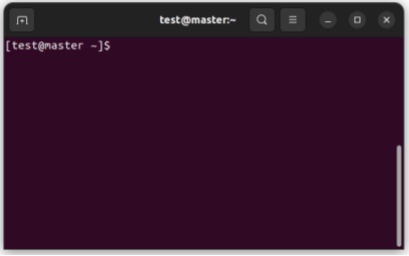

# Basic Linux Commands

Kuria cluster uses Rocky Linux as its operating system, which the user can access through the command prompt (CLI). While logging in to the cluster, the CLI would appear as follows:

<figure style="text-align: center;">
    
    <figcaption>  figure: Command Line Interface
</figcaption></figure>

Here : 
* test:  indicates the Username
* master: indicates the Hostname (node in which user is working on)
* ~ : indicates the working directory. Specifically, ~ denotes the home directory.
* $ : indicates the system is ready to take input. Sometimes denoted by “>”.

Basc Commands to user Linux terminal is given as follows:
### Keyboard Shortcuts

|   Commands   |                                                                                                                                    Action                                                                                                                                   |
|:------------:|:---------------------------------------------------------------------------------------------------------------------------------------------------------------------------------------------------------------------------------------------------------------------------:|
| Enter Key    | To run a command.                                                                                                                                                                                                                                                           |
| Up arrow     | To navigate command history backward.                                                                                                                                                                                                                                       |
| Down arrow   | To navigate command history forward.                                                                                                                                                                                                                                        |
| Tab Key      | Auto-completion or Tab completion. Completes the command if there are enough letters to identify it uniquely. If the letters are insufficient, nothing will show up. Pressing Tab twice will display a list of possible completions.                                   |
| Ctrl+Shift+c | To copy from the CLI.                                                                                                                                                                                                                                                       |
| Ctrl+Shift+v | To paste into the CLI.                                                                                                                                                                                                                                                      |
| Ctrl+c       | To stop the current command.                                                                                                                                                                                                                                                |
| Ctrl+z       | To suspend the current command.                                                                                                                                                                                                                                             |
| Ctrl+D       | Send “End-of-File” to the application. This will quit the terminal when on an empty command line and can be used to close SSH connections or exit from any subshells. It can also be used to clear the screen.                                                         |

### Working With Files and Directories

|                 Commands                 |                                                                             Action                                                                            |
|:----------------------------------------:|:-------------------------------------------------------------------------------------------------------------------------------------------------------------:|
| pwd                                      | Print the current working directory.                                                                                                                         |
| ls                                       | List all the files within the directory. Use `ls -a` to show all hidden files, and `ls -l` or `ll` to list complete info about the files.                 |
| cd <new_directory>                       | Change the current directory to a new directory.                                                                                                             |
| mkdir \<directory_name\>                 | Create a new directory with the given name.                                                                                                                  |
| rmdir \<directory_name\>                  | Remove the empty directory with the given name.                                                                                                             |
| touch \<file_name\>                       | Create a new file.                                                                                                                                             |
| cat \<file_name\>                         | View the contents of a file.                                                                                                                                 |
| rm \<file_name\>                          | Remove a file in the directory.                                                                                                                                 |
| cp \<old_file_name\> \<new_file_name\>   | Copy a file in the same directory with a different name.                                                                                                   |
| cp \<file_name\> \<directory_path\>       | Copy a file into a new directory.                                                                                                                           |
| mv \<file_name\> \<directory_path\>       | Move a file to a new directory.                                                                                                                                  |
| gzip file1 file2                          | Compress the files into a zipped folder.                                                                                                                      |
| gunzip file1 file2                        | Unzip files from a zipped folder.                                                                                                                              |

### Linux Networking Commands

|               Commands               |                                    Action                                   |
|:------------------------------------:|:---------------------------------------------------------------------------:|
| ip a  OR ip addr                     | Assign an IP address, initialize an interface, or disable an interface.     |
| ssh user_name@host(IP/Domain_name) | Create a remote connection through the SSH protocol.                         |
| mail -s "Subject" recipient_address | Send emails from the command line.                                          |
| ping <ip_address>                  | Check the connectivity between two nodes.                                   |
| host domain_name or ip_address      | Display the IP address for a given domain name and vice versa.              |

### Linux Utility Commands

|                         Commands                        |                                                                                                                                                                 Action                                                                                                                                                                |
|:-------------------------------------------------------:|:-------------------------------------------------------------------------------------------------------------------------------------------------------------------------------------------------------------------------------------------------------------------------------------------------------------------------------------:|
| find <path_to_directory> <search_term> -exec <command_name> | Find a file and execute the specified command.                                                                                                                                                             |
| locate filename                                         | Find a file from a pre-built database for quick searches (may not provide real-time updates).                                                                                                                                                                   |
| df                                                      | Display the disk space used in the file system.                                                                                                                                                                                                                                                                                     |
| top or htop                                             | Display all currently running tasks, including users, tasks, CPU load, and memory usage.                                                                                                                    |
| mpstat                                                  | Display usage for each processor.                                                                                                                                                                         |

